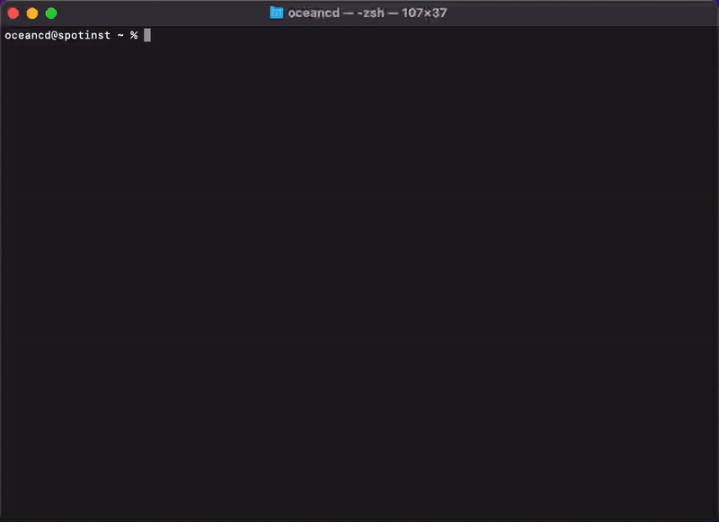
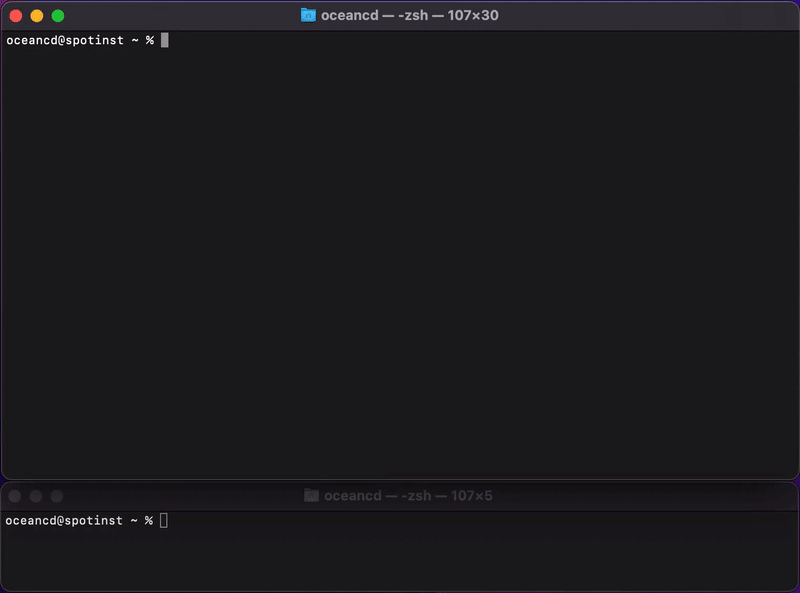

A command-line interface to manage your [Ocean CD](https://spot.io/) resources.

* [Overview](#overview)
* [Installing](#installing)
* [Upgrading](#upgrading)
* [Configuring](#configuring)
* [Usage](#usage)
    * [Ocean CD entities](#ocean-cd-entities)
    * [Rollouts](#rollouts)
    * [Workloads](#workloads)
* [Getting Help](#getting-help)
* [Community](#community)
* [License](#license)

## Overview
### What is Ocean CD?
Ocean CD provides DevOps and Infrastructure teams with out-of-the-box processes to reimplement
and share complex and mission-critical pieces of CD across different environments, such as
progressive delivery and verification of the software deployments. Service owners are able to
promote service changes to production without code or re-inventing deployment strategies.
Developers are able to commit with confidence, now that the deployment phases are managed and
visible.

### Why Ocean CD?
Ocean CD provides a central place to observe the deployment (e.g., state, progress, and resources).
These visibility features allow quick identification of issues during and after the deployment process
and ensure reliability at scale.

You will set up external verifications, the method Ocean CD uses to integrate your unique test
outcomes as part of an orchestrated release process, and define webhook API notifications to
communicate between Ocean CD and your external DevOps-related tools.

Ocean CD performs automated Rollback, a mission-critical feature not covered out of the box by
Kubernetes. You will be able to define the failure policy which determines the type of rollback that
will be employed

### Ocean CD Documentation
To learn more about Ocean CD please go to the [complete documentation](https://docs.spot.io/ocean-cd).

## Installing
### Homebrew
`oceancd` is available via [Homebrew](https://brew.sh/), and as a binary from the [releases page](https://github.com/spotinst/spot-oceancd-cli/releases/latest):

```
brew install spotinst/tap/oceancd
```

### macOS or Linux
To build Ocean CD CLI from the source you have to:
1. Download the suitable for your operating system release from [releases page](https://github.com/spotinst/spot-oceancd-cli/releases/latest):

   For example, to download version v0.0.11 on Linux, type:
    ```
    curl -OL https://github.com/spotinst/spot-oceancd-cli/releases/download/v0.11.0/oceancd-linux-amd64-0.11.0.tar.gz 
    ```

2. Unzip the file and make it executable:
    ```
    tar -xf oceancd-linux-amd64-0.11.0.tar.gz -C /usr/local/bin
    chmod +x /usr/local/bin/oceancd
    ```

3. Add the `/user/local/bin` path if the `PATH` variable doesn't contain it:
    ```
    PATH=$PATH:/user/local/bin
    ```

4. Ensure the version you installed is up-to-date:
    ```
    oceancd version
    ```

### Windows
1. Download the suitable for your operating system release from [releases page](https://github.com/spotinst/spot-oceancd-cli/releases/latest).

2. Create the `C:\oceancd\bin` folder and unzip the executable file into it.

3. Edit the `PATH` for your account:
    ```
    setx PATH "C:\oceancd\bin;%PATH%"
    ```

4. Ensure the version you installed is up-to-date:
    ```
    oceancd version
    ```

## Upgrading
To upgrade the latest CLI version please run the following command:
```
brew upgrade spotinst/tap/oceancd
```

## Configuring
### Prerequisites
Using `oceancd` requires having the **Spotinst access token** that might be generated by going to `Spotinst Account -> My account -> API -> Generate token` and **cluster ID** that might be found in the `Name` column at `Spotinst Account -> Settings -> Clusters`.

### Quick configuring
Run `oceancd configure` to set up an Ocean CD profile. Then you will be prompted with four pieces of information:
* Spotinst access token
* profile
* cluster ID
* namespace

After answering the prompt the profile will be created at `~/spotinst/.oceancd.ini`. The attempt to create a profile will rewrite the profile's info if the same named profile already exists.



### Options
All the pieces might be specified by using the corresponding flags:

```
$ oceancd configure                          \
    --clusterid example-cluster-id           \
    --namespace example-namespace            \
    --profile custom-profile                 \
    --token 0260949e76ddb3ead1d3f7518831f594 \
    --url https://custom.api.spotinst.com
```

The following profile will be created:
```
$ cat ~/spotinst/.oceancd.ini
[custom-profile]
token     = 0260949e76ddb3ead1d3f7518831f594
url       = https://custom.api.spotinst.com
clusterId = example-cluster-id
namespace = example-namespace
```

For more information run the help command `oceancd configure -h`.

### Autocompletion
The currently supported shells are:
* Bash
* Zsh
* fish
* PowerShell

To enable autocompletion generate code using the `oceancd complete` command run and put it into the file for configuring user environments (for example: `~/.bash_profile` for Mac OS, `~/.bashrc` for Linux, etc).

For example, for macOS `bash` run the following code:

```
## import the bash autocompletion profile 
echo '[[ -r /usr/local/etc/profile.d/bash_completion.sh ]] && . /usr/local/etc/profile.d/bash_completion.sh' >>~/.bash_profile
## enable oceancd autocompletion
echo 'source <(oceancd completion bash)' >>~/.bash_profile
## apply changes
. ~/.bash_profile
```

## Usage
Using `oceancd` allows to manage and monitor rollouts, workloads, and Ocean CD entities (Cluster, Strategy, RolloutSpec, VerificationProvider, VerificationTemplate).

The following command describes available API resources:
```
oceancd api-resources
```

The output is similar to the following:
```
  NAME (5)                SHORTNAMES   NAMESPACED   KIND                  
                                                                          
  strategies              stg,stgs     No           Strategy              
  rolloutSpecs            rs           Yes          RolloutSpec           
  clusters                             No           Cluster               
  verificationProviders   vp,vps       No           VerificationProvider  
  verificationTemplates   vt,vts       No           VerificationTemplate
```

### Profiling
By default `oceancd` uses the default profile contained at `~/spotinst/.oceancd.ini`. The default behavior might be changed by using the `--profile` flag:

```
oceancd get stgs --profile=prod
```

### Ocean CD entities
To retrieve info about Ocean CD entities that are available for your Spotinst account, apply or delete them use the corresponding `get`, `apply`, and `delete` commands.
See the following example:

```
oceancd apply -f ./strategy-example.json
```

Enter the following code into the terminal to list all the Clusters defined within the "prod" Spotinst account, in `JSON` format:

```
oceancd get cluster -o json --profile=prod
```

See the [samples' page](https://github.com/spotinst/spot-oceancd-cli/tree/main/samples) for the config examples.

### Rollouts
<p></p>

The `oceancd rollout` consists of multiple subcommands which can perform changes on a SpotDeployment rollout, namely:

* stop progressing the actual and rollback the previous rollout
* retrieve details about a rollout, especially in live mode
* manually pause the progressing rollout
* partly or fully promote a rollout circumvent the established conditions and verifications

To display info about current and new SpotDeployment versions, the status of the rollout, result of verifications, phase's status, etc, run the following:
```
oceancd rollout get ROLLOUT_ID
```

The following flags are supported for the `oceancd rollout get` subcommand:
* `--watch` - watch live updates to the rollout
* `--timeout-seconds int` - sets a timeout after specified seconds
* `--no-color` - prevents output colorizing

For more details run `oceancd rollout -h`.

### Workloads
Using `oceancd workload` command gives the next possibilities:
* restart currently running pods
* roll back to one of the last 20 revisions

For example, rolling-back of the `third` revision of SpotDeployment with the `demo-oceancd` name might be performed by running the following code:

```
oceancd workload rollback demo-oceancd 3
```

The output is the following:
```
Successfully rolled back workload demo-oceancd
```

For more details run `oceancd workload -h`.

### Global flags
Here are all the supported global flags:

```
--profile string   sets the used credentials profile
--token string     sets unique spot token for API authentication
--url string       sets API url
```

## Getting Help
We use GitHub issues for tracking bugs and feature requests. Please use these community resources for getting help:

- Join our Spot community on [Slack](http://slack.spot.io/).
- Open an [issue](https://github.com/spotinst/spot-oceancd-cli/issues/new).

## Community
- [Slack](http://slack.spot.io/)
- [Twitter](https://twitter.com/spot_hq/)

## License
Code is licensed under the [Apache License 2.0](LICENSE).